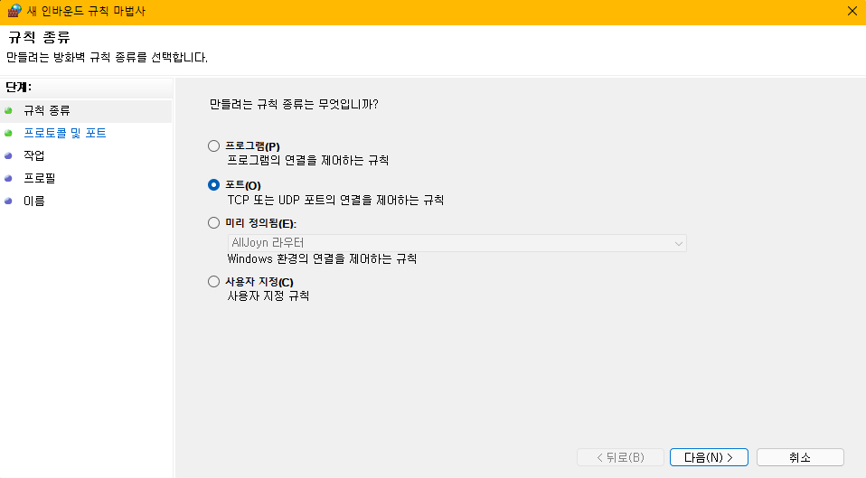

**💡목표**

- Public IP 주소를 입력하면 WSL2 local 보여주기.

**⚡ 환경**

- 공유기를 통제할 수 있는 환경에서 테스트를 진행해야 합니다.
- 윈도우 PC여야 합니다.
- 유무선 인터넷이 되는 환경이어야 합니다.

# 1. 들어가며

이해를 돕기 위한 기초 개념을 간략히 설명하겠습니다.

## 1.1. IPv4 IPv6

**IP**라는 글자뒤에 v4 , v6가 붙은 형태에요.

미뤄 짐작해봅시다.  
IP는 ip주소할 때 ip라고 예측할 수 있겠고.  
v는 version의 약자라고 유추할 수 있겠네요.

그러면 아이피 4세대, 아이피 6세대 쯤으로 생각할 수 있겠어요.

### 1.1.1 왜 버전6이 필요했을까?

version4는 약 **46억개**의 주소를 사용할 수 있게 만들어졌어요.  
인구가 60억 이상이니, 지금은 46억개를 훨씬 넘었겠죠?  
컴퓨터가 누구에게나 사용될 줄 몰랐나봐요.

IPv6은 약 43억\*43억\*43억\*43억개를 만들 수 있어요.  
엄청난 숫자죠?  
과연 새로운 버전의 IP가 나오는 날이 올까요?

## 1.2. LAN 과 WAN

### 1.2.1. LAN

LAN이란 말 많이 들어보셨죠?  
Local Area Network의 약자입니다.

로컬 영역에서의 네트워크 환경입니다.  
사무실, 가정집, 학교 정도의 범위(Area)입니다.

### 1.2.2. WAN

WAN은 Wide Area Network의 약자입니다.

지역, 국가, 세계 범위(Area)입니다.

# 2. 본론

## 2.1. 출발점 -> 중간과정 -> 도착점

시작점과 도착점뿐만 아니라 과정을 상세히 알아야  
목적지에 도착할 수 있습니다.

우리는 출발점 브라우저와  
도착지 WSL2 사이에 "Windows"라는 중간길을 끼고 있습니다.

윈도우 서버가 실행되어야만 WSL이 작동하니,  
윈도우 서버를 거치지 않고는 WSL에 도착할 수 없겠죠?

즉 외부에서 내 WSL2 서버로 들어오기 위해서는  
"공인IP -> Window -> WSL"순서라고 생각해볼 수 있겠네요.

### 2.1.1. 출발점 (공인 IP)

각자 구글에 "내 아이피 확인"을 검색해보세요.  
또는
WSL에 입력해보세요.

```bash
curl ifconfig.me
```

아이피 주소가 나올 겁니다.

주소를 브라우저에 입력해보세요.
공유기 설정 화면이 나타날 겁니다.  
출발점을 찾았습니다. 축하드립니다.

방금 접속한 주소는 공인아이피 입니다.

공인아이피의 반댓말은 사설아이피입니다.  
영어로 보면 Public <-> Private

공인아이피는 인터넷 환경이면 누구나 접속 가능한 주소이고  
사설아이피는 같은 네트워크 안에서만 접속이 가능한 주소입니다.

### 2.1.2. 중간과정 (사설 IP)

사설 IP는 기기마다 다릅니다.  
기기 2개를 갖고 같은 와이파이를 연결해보세요  
다른 아이피를 확인할 수 있을 겁니다.

```powershell
# cmd or powershell에서
ipconfig
```

무선 LAN 어뎁터 WIFI에 IPv4주소를 확인해보세요  
현재 Windows의 사설 아이피 주소입니다.

WSL은 윈도우 위에서 돌아간다고 했죠?  
공인IP -> 사설 IP -> WSL IP로 연결을 해줘야겠죠?

### 2.1.3. 도착점 WSL IP

WSL은 윈도우와 이더넷 어뎁트를 통해 연결되어 있습니다.  
net-tools를 이용해 wsl의 ip를 알아낼 겁니다.

```bash
sudo apt install net-tools
```

```bash
ifconfig
```

ifconfig를 입력하면, "**eth0**:"가 보일 겁니다.  
이더넷에 연결된 정보들이 보입니다.  
그 중에서 inet의 주소가 WSL2의 주소입니다.

## 2.2. 연결하기

이제 도착점까지 알았으니 이 모든 IP를 모두 연결해주면 되겠죠?

### 2.2.1. Public -> Windows

공유기 설정에 들어가면 포워딩이라는 항목이 있을 겁니다.

WSL에서 사용할 포트 === 서비스 포트 === 내부 포트  
를 만들어주시면 되겠습니다.

### 2.2.2. Windows -> WSL

- WSL과 연결해주기

powershell을 관리자로 실행시켜줍니다.

```powershell
netsh interface portproxy add v4tov4 listenport=${port} listenaddress=${address} connectport=${port} connectaddress=${WSLip}
```

listenport, connectport에는 WSL에서 사용할 포트를 입력해주고  
listenaddress 는 생략 or 0.0.0.0 or \* 입력해주면 모든 주소를 허용합니다. 사설 아이피 주소를 입력해주면 사설아이피 주소를 허용해주는 겁니다.  
connectaddress에는 WSL2주소를 입력해주면 됩니다. WSL 터미널에서 inet주소를 확인했었죠?

- 윈도우 방화벽 열어주기

💡방법 1.

powershell 관리자로 실행시켜줍니다.

```powershell
netsh advfirewall firewall add rule name=$[name] dir=in action=allow protocol=TCP localport=${port}
```

localport에는 방화벽 허용해줄 포트를 입력해줍니다. ( WSL 포트)

name에는 본인이 알아볼 수 있는 이름을 적어주시면 됩니다.  
포트번호를 적어주면 직관적입니다.

💡방법 2.

제어판 - 시스템 및 보안 - Windows Defender 방화벽 - 고급설정 - 인바운드 규칙

오른쪽 편에 **새 규칙** 클릭 후



특정포트에서 WSL포트를 입력해주고 방화벽을 열어주면 됩니다.

## 2.3. 번외 명령어

```powershell
netsh interface portproxy reset
```

```powershell
netsh interface portproxy show v4tov4
```

## 2.4. WSL2에서 실행시켜보기

특정 포트를 열어줬으면 서버를 하나 실행시켜 봅니다.

공인아이피:포트 -> 사설아이피:포트 -> WSL서버:포트 로 연결을 마쳤습니다.

같은 네트워크 환경에서는  
사설아이피:포트로 접속하면, WSL서버:포트로 연결됩니다.

# 3. 마무리

## 3.1. 에러사항

1. 위와같이 다했는데 접속이 안 될 때

   - npm proxy 허용 or yarn proxy 허용을 검토해보세요
   - 해당 서버가 프록시접속이 허용되는지 확인해보세요.

apache나 nginx를 이용하여 테스트를 해보세요.  
어디서 문제인지 알 수 있을 겁니다.
