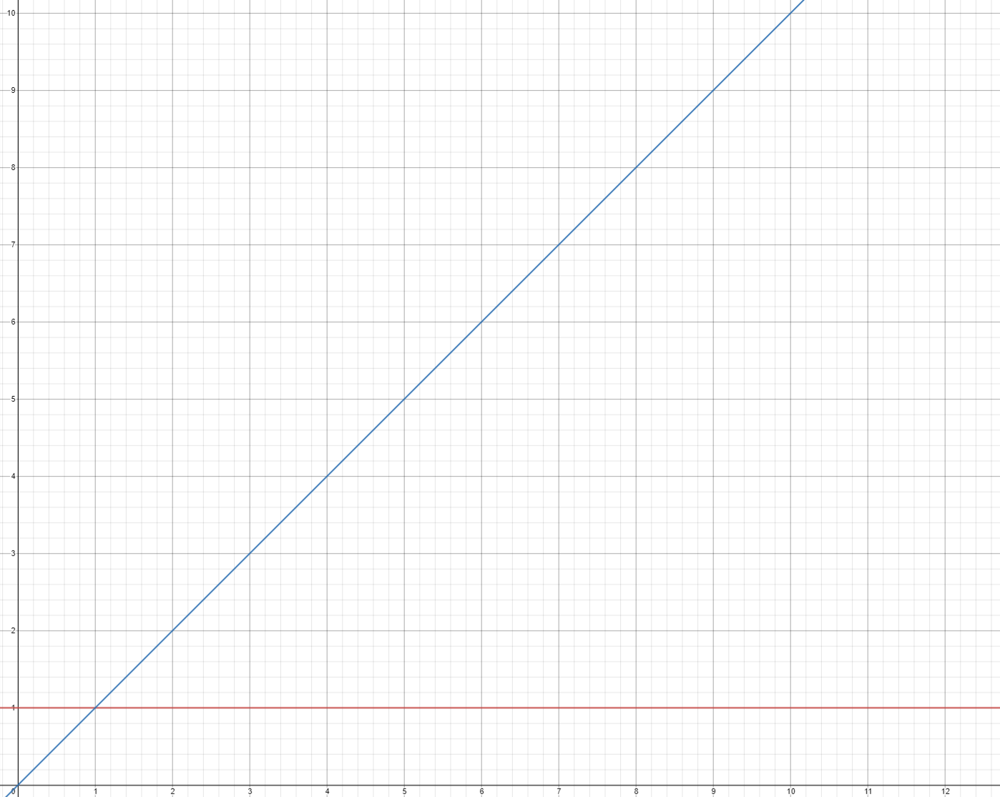

위 내용은 **"누구나 자료구조와 알고리즘 <제이 웬그로우, 심지현 옮김> 길벗"**에서 발췌했습니다.

# 1. BIG(O) 빅오

빅 오는 알고리즘에 필요한 단계 수만 고려함으로써 일관성을 유지한다.

O(1)은 데이터 크기와 상관없이 알고리즘에 필요한 단계 수가 1단계다.  
구형 컴퓨터는 20분이 걸렸다면, 요즘 컴퓨터는 1초만에 처리할 수도 있다.

연산에 필요한 단계가 1단계이기 때문에 효율성을 O(1)이라 표기한다.

## 1.1. 선형검색

빅 오 표기법으로 선형검색은 O(N)으로 표기할 수 있다.  
선형 검색은 한 번에 한 셀씩 확인해서 배열에서 특정 값을 검색한다.  
따라서 원소가 N개 있을 때 최악의 경우 N번의 단계를 거칠 수 있기 때문에,  
O(N)이라 표기한다.

위의 사진에서,  
y = x와 y = 1의 그래프가 존재한다.

y=1는 O(1), y=x O(N)이다.

O(N)은 데이터가 추가될 때마다, x값이 커질 때마다,  
알고리즘이 한 단계가 더 걸린다.  
이러한 이유로 O(N)을 선형시간(linear time)이라고도 부른다.

O(1)은 데이터와 관계없이 항상 일정하다.  
상수시간이라고 부르기도 한다.

## 2. 본질

빅 오는 **데이터 양이 변할 때** 알고리즘 성능이 어떻게 변하는지를 설명한다.  
두 단계 이상 걸리는 알고리즘이라도 O(1)로 표기할 수 있다.  
데이터가 아무리 커져도 3단계가 걸리는 알고리즘이 있다고 하자.  
이 알고리즘은 데이터가 아무리 늘어나도 단계 수는 상수로 유지되므로  
상수 시간이라고 할 수 있고 O(1)로 표기가 가능하다.

그럼 O(3)이라교 표기해야 되는 거 아니야?  
라고 생각할 수 있지만,  
빅 오 표기법에서는 단계의 실질적인 개수보다  
데이터가 늘어나도 단계가 늘어나느냐에 집중한다.

O(1)은 데이터가 아무리 커지더라도 단계 수가 변하지 않는  
모든 알고리즘을 표현하는 방법이다.

##💡 O(log N)

O(logN)은 데이터가 두 배로 증가할 때마다 한 단계씩 늘어나는 알고리즘이다.
